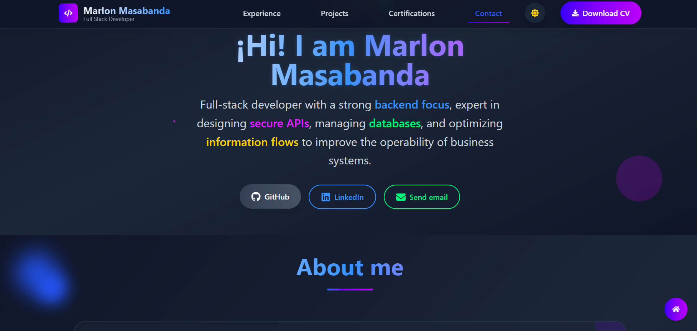
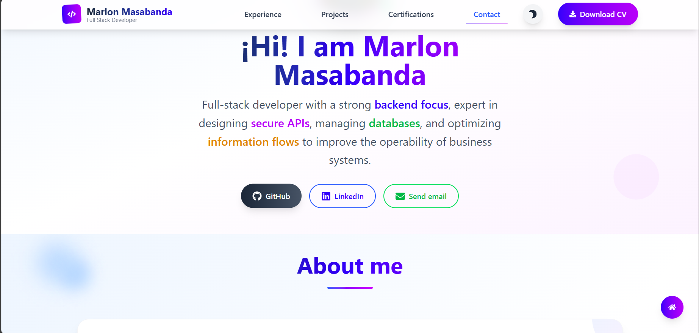

# 🌐 My Portfolio — Marlon Masabanda

This is my personal portfolio built with React, TypeScript, and Tailwind CSS. It showcases my projects, professional experience, certifications, and provides a way to get in touch. It includes smooth animations with Framer Motion and dark mode support.

## 🚀 Main Technologies

- ⚛️ React + TypeScript
- 🎨 Tailwind CSS
- 🎞️ Framer Motion
- 🌙 Dark mode with Context API
- 📁 Deployed on Vercel

## 📷 Preview




## 📦 Local Setup

```bash
git clone https://github.com/YasArcher/my-portfolio
cd my-portafolio
npm install
npm run dev
```

## ☁️ Deployment

This site is deployed on [Vercel](https://vercel.com), enabling continuous deployment from the `main` branch.

## 📄 License

MIT © Marlon Masabanda
